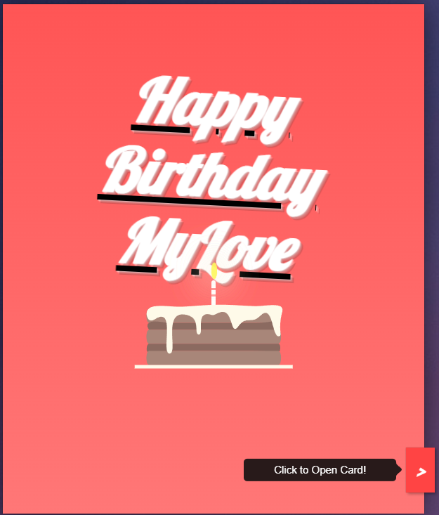
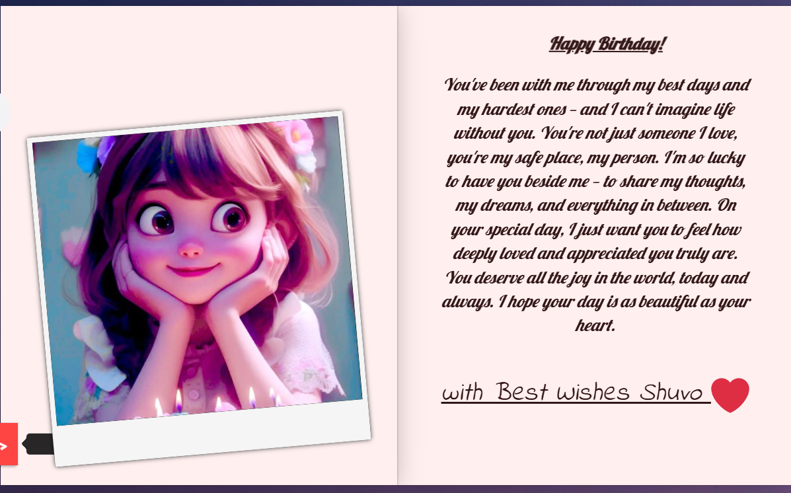

<h1>🎉 Birthday Wish Card | MyLove Edition</h1>

A heartwarming and animated web-based birthday card made with only HTML, CSS, and JS — no backend or framework needed. This page is designed to give your loved ones a memorable digital surprise! 💝

<h3>🔗 Live Demo:</h3>

<a href="https://engrshuvodas.github.io/Birthday-Wish-Card/" target="_blank">Click here to view the Birthday Wish Card</a>

<h2>💡 Features</h2>
<ul>
  <li>🎂 Animated 3D Birthday Cake with candle flames</li>
  <li>💌 Flip-card style birthday message</li>
  <li>🎶 Background music with autoplay support</li>
  <li>❤️ Sweet and emotional custom text inside the card</li>
  <li>📸 Includes personal photo section</li>
  <li>🔗 Smooth link to the second page with more wishes</li>
  <li>💻 Fully responsive (desktop & mobile)</li>
</ul>

<h2>📁 Project Structure</h2>

<pre>
Birthday-Wish-Card/
├── img/
│   ├── girl1.jpg
│   └── girl2.jpeg
├── b-home-song.mpeg        ← Optional background song
├── bbd.html                ← Second birthday message page
├── bg.jpg                  ← Background image
├── bsong.mpeg              ← Main birthday song
├── favicon.ico             ← Website favicon
├── index.html              ← Main birthday card (landing page)
├── index.js                ← JavaScript logic for animation
├── LICENSE                 ← License file
├── preview1.png            ← Screenshot preview 1
├── preview2.png            ← Screenshot preview 2
├── preview3.png            ← Screenshot preview 3
├── README.md               ← This file
├── style.css               ← Main styling for birthday page
└── style2.css              ← Optional alternate style
</pre>

<h2>📸 Previews</h2>

<h4>🎂 Birthday Cake Animation </h4>

<h4>🎀 Card Preview</h4>

<h4>💝 Message Area</h4>

<h2>🚀 How to Use</h2>
<ol>
  <li>Clone or Download this repository:</li>
</ol>

<pre><code>git clone https://github.com/engrshuvodas/Birthday-Wish-Card.git</code></pre>

<ol start="2">
  <li>Customize <code>index.html</code> and <code>bbd.html</code> with your own message, photos, and music.</li>
  <li>Open <code>index.html</code> in your browser.</li>
  <li>Host it using GitHub Pages or any web hosting service.</li>
</ol>

<h2>📝 License</h2>

This project is licensed under the <a href="LICENSE">MIT License</a>.

<h2>💬 Special Thanks</h2>

Made with ❤️ by <a href="https://github.com/engrshuvodas" target="_blank">Shuvo Das</a> — because love deserves more than just a simple message.

